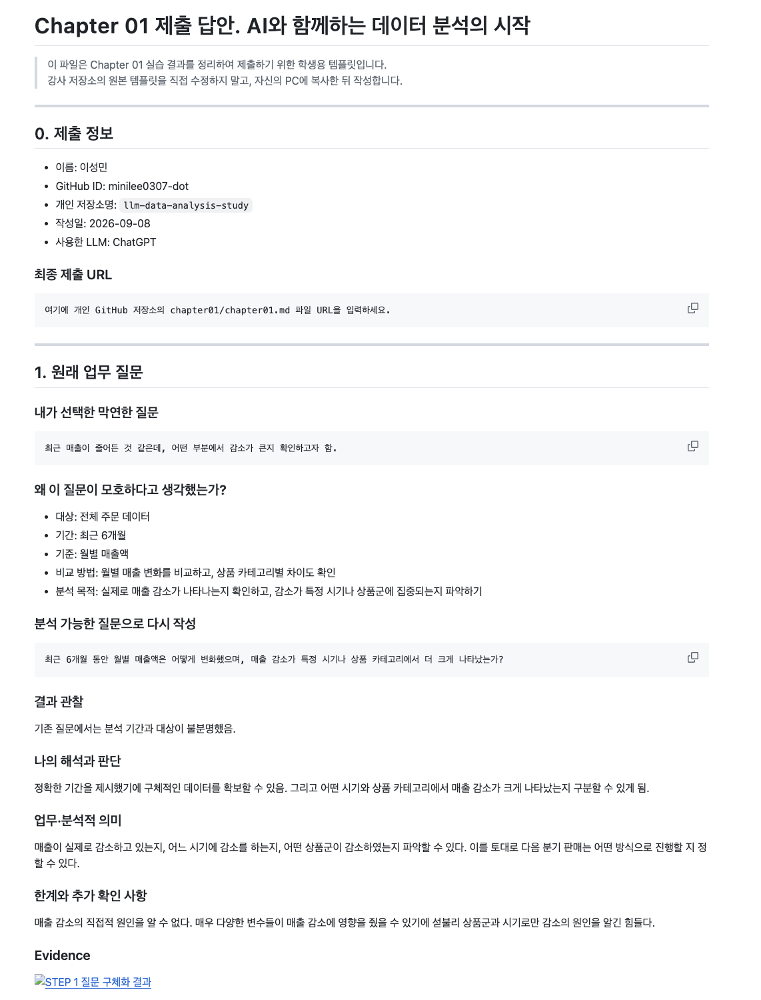
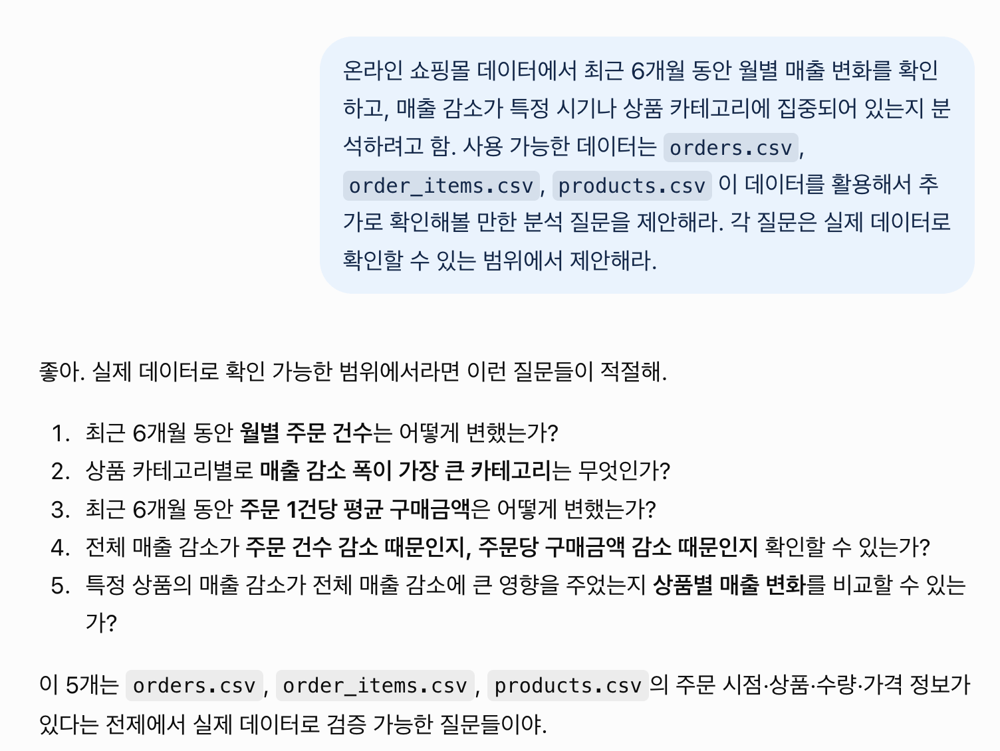
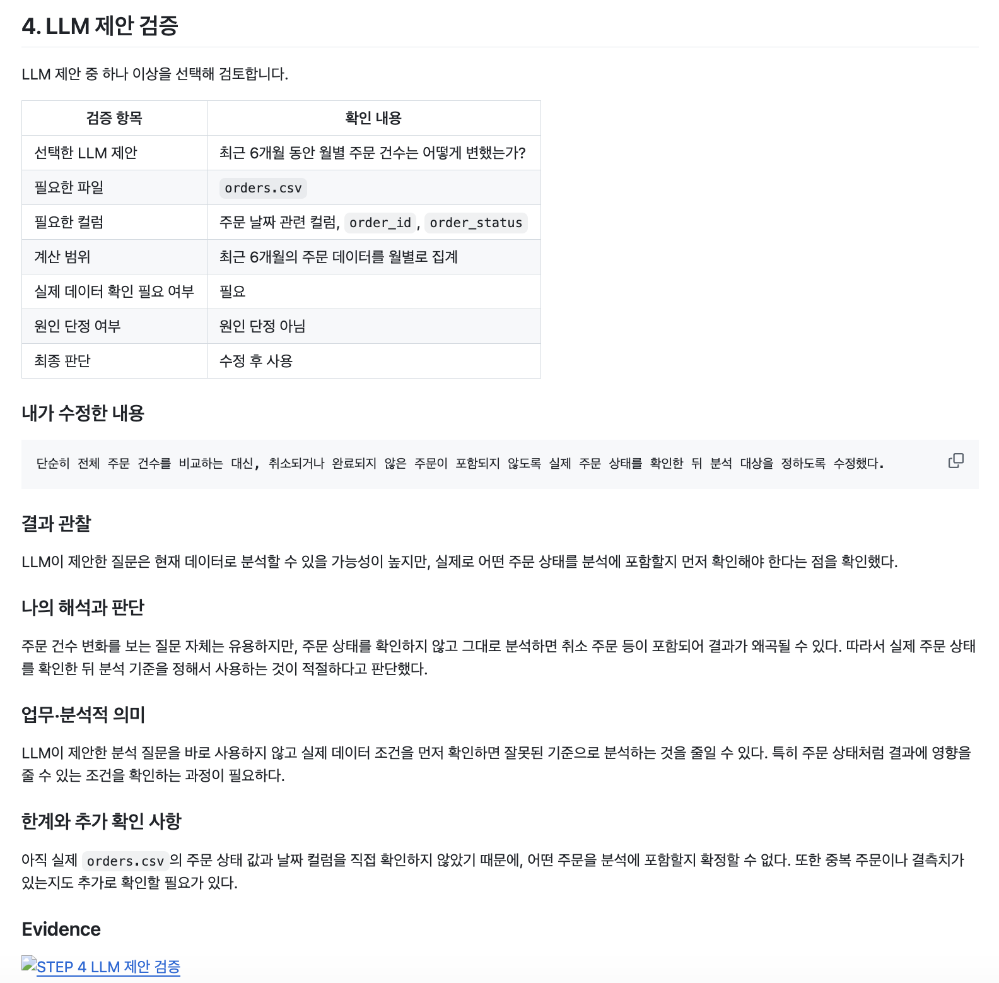
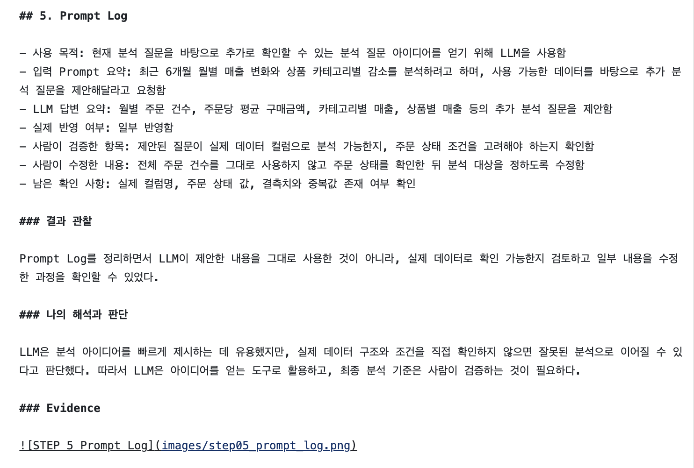

# Chapter 01 제출 답안. AI와 함께하는 데이터 분석의 시작

> 이 파일은 Chapter 01 실습 결과를 정리하여 제출하기 위한 학생용 템플릿입니다.  
> 강사 저장소의 원본 템플릿을 직접 수정하지 말고, 자신의 PC에 복사한 뒤 작성합니다.

---

## 0. 제출 정보

- 이름: 이성민
- GitHub ID: minilee0307-dot
- 개인 저장소명: `llm-data-analysis-study`
- 작성일: 2026-09-08
- 사용한 LLM: ChatGPT

### 최종 제출 URL

```text
여기에 개인 GitHub 저장소의 chapter01/chapter01.md 파일 URL을 입력하세요.
```

---

## 1. 원래 업무 질문

### 내가 선택한 막연한 질문

```text
최근 매출이 줄어든 것 같은데, 어떤 부분에서 감소가 큰지 확인하고자 함.
```

### 왜 이 질문이 모호하다고 생각했는가?

- 대상: 전체 주문 데이터
- 기간: 최근 6개월
- 기준: 월별 매출액
- 비교 방법: 월별 매출 변화를 비교하고, 상품 카테고리별 차이도 확인
- 분석 목적: 실제로 매출 감소가 나타나는지 확인하고, 감소가 특정 시기나 상품군에 집중되는지 파악하기

### 분석 가능한 질문으로 다시 작성

```text
최근 6개월 동안 월별 매출액은 어떻게 변화했으며, 매출 감소가 특정 시기나 상품 카테고리에서 더 크게 나타났는가?
```

### 결과 관찰

기존 질문에서는 분석 기간과 대상이 불분명했음. 

### 나의 해석과 판단

정확한 기간을 제시했기에 구체적인 데이터를 확보할 수 있음. 그리고 어떤 시기와 상품 카테고리에서 매출 감소가 크게 나타났는지 구분할 수 있게 됨.

### 업무·분석적 의미

매출이 실제로 감소하고 있는지, 어느 시기에 감소를 하는지, 어떤 상품군이 감소하였는지 파악할 수 있다. 이를 토대로 다음 분기 판매는 어떤 방식으로 진행할 지 정할 수 있다.

### 한계와 추가 확인 사항

매출 감소의 직접적 원인을 알 수 없다. 매우 다양한 변수들이 매출 감소에 영향을 줬을 수 있기에 섣불리 상품군과 시기로만 감소의 원인을 알긴 힘들다.

### Evidence



---

## 2. 질문과 필요한 데이터 연결

### 필요한 데이터 파일

- [ ] `customers.csv`
- [x] `products.csv`
- [x] `orders.csv`
- [x] `order_items.csv`

### 필요한 컬럼 후보

| 파일 | 필요한 컬럼 | 필요한 이유 |
| orders.csv | order_id, 주문 날짜 관련 컬럼, order_status | 주문 시점과 주문 상태를 확인하기 위해 |
| order_items.csv | order_id, product_id, quantity, unit_price  | 각 주문의 상품별 수량과 금액을 계산하기 위해 |
| products.csv | product_id, category | 상품별 카테고리를 확인하고 카테고리별 매출을 비교하기 위해 |

### 데이터 연결 관계

```text
orders.csv와 order_items.csv는 order_id를 기준으로 연결하고, order_items.csv와 products.csv는 product_id를 기준으로 연결한다.
```

### 결과 관찰

질문에 답하기 위해서는 주문 시점과 상태를 확인할 수 있는 주문 데이터, 상품별 수량과 가격을 확인할 수 있는 주문 상세 데이터, 그리고 상품 카테고리를 확인할 수 있는 상품 데이터가 필요하다는 것을 확인했다.

### 나의 해석과 판단

현재 질문은 주문 날짜, 주문 금액, 상품 카테고리 정보를 확인할 수 있다면 분석할 수 있다고 판단했다. 따라서 orders.csv, order_items.csv, products.csv를 연결하면 질문에 필요한 대부분의 정보를 얻을 수 있다.

### 업무·분석적 의미

분석을 시작하기 전에 질문과 필요한 데이터를 연결해 두면, 불필요한 데이터를 확인하는 시간을 줄이고 실제로 필요한 정보가 무엇인지 명확하게 파악할 수 있다.

### 한계와 추가 확인 사항

아직 실제 데이터 파일을 직접 확인하지 않았기 때문에 필요한 컬럼이 실제로 존재하는지, 컬럼 이름이 무엇인지, 데이터 타입이 적절한지 확인이 필요하다. 또한 결측치나 중복값이 있는지도 추가로 확인해야 한다.

### Evidence

필요한 경우 관계도 또는 데이터 파일 확인 화면을 첨부하세요.


---

## 3. LLM에게 분석 질문 후보 요청

### 사용 목적

```text
현재 질문을 바탕으로 어떤 분석 질문을 더 만들 수 있는지 아이디어를 얻고, 내가 생각하지 못한 분석 방향이 있는지 확인하기 위해 LLM을 사용했다.
```

### 사용한 Prompt

```text
온라인 쇼핑몰 데이터에서 최근 6개월 동안 월별 매출 변화를 확인하고, 매출 감소가 특정 시기나 상품 카테고리에 집중되어 있는지 분석하려고 함.
사용 가능한 데이터는 `orders.csv`, `order_items.csv`, `products.csv`
이 데이터를 활용해서 추가로 확인해볼 만한 분석 질문을 5개 제안해라. 각 질문은 실제 데이터로 확인할 수 있는 범위에서 제안해라.
```

### LLM 답변 요약

LLM의 전체 답변을 그대로 복사하지 말고 핵심 제안 3~5개를 요약하세요.

1. 최근 6개월 동안 월별 주문 건수가 어떻게 변했는지 확인한다.
2. 상품 카테고리별 매출 변화를 비교해 감소 폭이 큰 카테고리를 찾는다.
3. 월별 주문당 평균 구매금액의 변화를 확인한다.
4. 매출 감소가 주문 건수 감소 때문인지 주문당 구매금액 감소 때문인지 비교한다.
5. 상품별 매출 변화를 비교해 특정 상품이 전체 매출 감소에 크게 영향을 주었는지 확인한다.

### 결과 관찰

LLM은 월별 주문 건수, 주문당 평균 구매금액, 상품 카테고리별 매출, 상품별 매출처럼 매출 감소를 여러 기준으로 나누어 확인할 수 있는 질문을 제안했다.

### 나의 해석과 판단

월별 주문 건수나 주문당 평균 구매금액처럼 매출 감소를 더 구체적으로 나누어 볼 수 있는 질문은 유용하다고 판단했다.
다만 실제 데이터에 필요한 컬럼이 존재하는지 확인한 뒤 사용할 필요가 있다.

### 업무·분석적 의미

LLM을 활용하면 처음부터 모든 분석 질문을 혼자 떠올리지 않아도 여러 분석 방향을 빠르게 얻을 수 있다. 특히 매출 감소를 주문 건수, 평균 구매금액, 상품별 매출 등으로 나누어 볼 수 있어 다음 분석 방향을 정하는 데 도움이 된다.

### 한계와 추가 확인 사항

LLM이 제안한 질문이 모두 실제 데이터로 분석 가능한지는 아직 확인하지 않았다. 특히 주문 날짜, 가격, 수량, 상품 카테고리와 같은 필요한 컬럼이 실제로 존재하는지 확인해야 하며, 데이터에 없는 정보까지 가정하지 않도록 주의할 필요가 있다.

### Evidence



---

## 4. LLM 제안 검증

LLM 제안 중 하나 이상을 선택해 검토합니다.

| 검증 항목 | 확인 내용 |
| --- | --- |
| 선택한 LLM 제안 | 최근 6개월 동안 월별 주문 건수는 어떻게 변했는가? |
| 필요한 파일 | `orders.csv` |
| 필요한 컬럼 | 주문 날짜 관련 컬럼, `order_id`, `order_status` |
| 계산 범위 | 최근 6개월의 주문 데이터를 월별로 집계 |
| 실제 데이터 확인 필요 여부 | 필요 |
| 원인 단정 여부 | 원인 단정 아님 |
| 최종 판단 | 수정 후 사용 |

### 내가 수정한 내용

```text
단순히 전체 주문 건수를 비교하는 대신, 취소되거나 완료되지 않은 주문이 포함되지 않도록 실제 주문 상태를 확인한 뒤 분석 대상을 정하도록 수정했다.
```

### 결과 관찰

LLM이 제안한 질문은 현재 데이터로 분석할 수 있을 가능성이 높지만, 실제로 어떤 주문 상태를 분석에 포함할지 먼저 확인해야 한다는 점을 확인했다.

### 나의 해석과 판단

주문 건수 변화를 보는 질문 자체는 유용하지만, 주문 상태를 확인하지 않고 그대로 분석하면 취소 주문 등이 포함되어 결과가 왜곡될 수 있다. 따라서 실제 주문 상태를 확인한 뒤 분석 기준을 정해서 사용하는 것이 적절하다고 판단했다.

### 업무·분석적 의미

LLM이 제안한 분석 질문을 바로 사용하지 않고 실제 데이터 조건을 먼저 확인하면 잘못된 기준으로 분석하는 것을 줄일 수 있다. 특히 주문 상태처럼 결과에 영향을 줄 수 있는 조건을 확인하는 과정이 필요하다.

### 한계와 추가 확인 사항

아직 실제 `orders.csv`의 주문 상태 값과 날짜 컬럼을 직접 확인하지 않았기 때문에, 어떤 주문을 분석에 포함할지 확정할 수 없다. 또한 중복 주문이나 결측치가 있는지도 추가로 확인할 필요가 있다.

### Evidence



---

## 5. Prompt Log

- 사용 목적: 현재 분석 질문을 바탕으로 추가로 확인할 수 있는 분석 질문 아이디어를 얻기 위해 LLM을 사용함
- 입력 Prompt 요약: 최근 6개월 월별 매출 변화와 상품 카테고리별 감소를 분석하려고 하며, 사용 가능한 데이터를 바탕으로 추가 분석 질문을 제안해달라고 요청함
- LLM 답변 요약: 월별 주문 건수, 주문당 평균 구매금액, 카테고리별 매출, 상품별 매출 등의 추가 분석 질문을 제안함
- 실제 반영 여부: 일부 반영함
- 사람이 검증한 항목: 제안된 질문이 실제 데이터 컬럼으로 분석 가능한지, 주문 상태 조건을 고려해야 하는지 확인함
- 사람이 수정한 내용: 전체 주문 건수를 그대로 사용하지 않고 주문 상태를 확인한 뒤 분석 대상을 정하도록 수정함
- 남은 확인 사항: 실제 컬럼명, 주문 상태 값, 결측치와 중복값 존재 여부 확인

### 결과 관찰

Prompt Log를 정리하면서 LLM이 제안한 내용을 그대로 사용한 것이 아니라, 실제 데이터로 확인 가능한지 검토하고 일부 내용을 수정한 과정을 확인할 수 있었다.

### 나의 해석과 판단

LLM은 분석 아이디어를 빠르게 제시하는 데 유용했지만, 실제 데이터 구조와 조건을 직접 확인하지 않으면 잘못된 분석으로 이어질 수 있다고 판단했다. 따라서 LLM은 아이디어를 얻는 도구로 활용하고, 최종 분석 기준은 사람이 검증하는 것이 필요하다.

### Evidence



---

## 6. 개인정보와 Secret 보호 확인

다음 항목을 확인합니다.

- [x] 실제 이름·이메일·전화번호 등 고객 개인정보를 Prompt에 사용하지 않았습니다.
- [x] API Key를 코드나 Notebook에 직접 작성하지 않았습니다.
- [x] `.env` 실제 내용을 캡처하거나 업로드하지 않았습니다.
- [x] GitHub Token, 비밀번호, 내부 URL이 캡처에 보이지 않습니다.
- [x] 제출 전 이미지까지 다시 확인했습니다.

### 나의 판단

고객의 이름, 이메일, 전화번호와 같은 개인정보나 API Key, 비밀번호, GitHub Token 같은 인증 정보는 LLM이나 Public GitHub에 올리면 안 된다고 판단했다. 이러한 정보가 노출되면 개인정보 침해나 계정 보안 문제가 발생할 수 있기 때문이다.

---

## 7. Chapter 01 Notebook 확인

Notebook:

```text
notebooks/ch01_ai_data_analysis_intro.ipynb
```

### 내 환경 상태

- [x] 아직 환경설정 전이라 Notebook 위치만 확인했습니다.
- [ ] 환경설정이 완료되어 Notebook을 직접 실행했습니다.

### 환경설정 완료 학생만 작성

#### 실행한 코드

```python
from pathlib import Path

import pandas as pd
import numpy as np
import matplotlib.pyplot as plt
import seaborn as sns

DATA_DIR = Path('../data/raw')
sns.set_theme(style='whitegrid')
```

#### 실행 결과

```text
오류 없이 실행되었는지 작성하세요.
```

#### 결과 관찰

실행 결과에서 확인한 사실을 작성하세요.

#### 나의 해석과 판단

현재 Notebook이 본격 분석이 아니라 starter scaffold라는 의미를 자신의 말로 설명하세요.

#### 한계와 추가 확인 사항

Chapter 02 또는 Chapter 03에서 추가로 확인해야 할 내용을 작성하세요.

#### Evidence


> 환경설정 전이라면 이 이미지는 생략할 수 있습니다.

---

## 8. Chapter 01 최종 해석

### 이번 장에서 가장 중요하다고 생각한 내용

```text
아이디어 제공자는 사람이어야 한다. 데이터를 보고 어떤 정보들이 있는지 잘 파악하여 이에 알맞는 질문을 생각하여야 한다. 물론 매끄럽지 못하다 해도 괜찮다. 그런 부분들은 LLM이 도와줄 수 있으니까. 다만 핵심적인 아이디어나 원리는 사람이 먼저 해야하는게 중요한 것 같다. 그리고 데이터를 파악할때 어떤 정보들이 남아 있는지 잘 파악하고 질문을 구상해야겠다.
```

### LLM을 데이터 분석에 사용할 때 가장 조심해야 할 점

```text
LLM의 답변이 자연스럽고 그럴싸하게 주더라도, 환각이 일어나 데이터 내에 없는 정보를 지어내는 경우가 있기에, 사람이 먼저 데이터를 잘 파악하는 습관을 가져야겠다.
```

### 사람과 LLM의 역할 차이

| 항목 | LLM이 도울 수 있는 부분 | 사람이 책임져야 하는 부분 |
| --- | --- | --- |
| 질문 정의 | 분석 질문 후보를 제안하고 질문을 구체화하는 데 도움 | 실제 목적에 맞는 질문인지 최종 판단 |
| 데이터 확인 | 어떤 데이터나 컬럼이 필요할지 제안 | 실제 파일과 컬럼이 존재하는지 직접 확인 |
| 코드 작성 | 분석 코드 초안 작성 및 수정 아이디어 제안 | 코드가 정확한지 검증하고 오류를 수정 |
| 결과 해석 | 결과의 의미나 가능한 해석을 제안 | 데이터와 맥락에 맞는 해석인지 판단 |
| 최종 판단 | 여러 선택지나 분석 방향 제시 | 최종 결론과 의사결정에 대한 책임 |

### 다음 Chapter에서 확인하고 싶은 것

```text
다음 Chapter에서는 Python, VS Code, 가상환경, Jupyter Notebook이 각각 무엇이고 서로 어떻게 연결되는지 직접 설정해보면서 이해하고 싶다. 또한 실제 CSV 파일을 불러와 데이터의 컬럼과 구조를 확인하는 방법도 익혀보고 싶다.
```

---

## 9. 최종 제출 체크리스트

- [x] 원래 업무 질문과 구체화한 분석 질문을 작성했습니다.
- [x] 질문에 필요한 데이터 파일과 컬럼 후보를 정리했습니다.
- [x] LLM Prompt와 답변 요약을 작성했습니다.
- [x] LLM 제안을 실제 데이터 관점에서 검증했습니다.
- [x] 각 핵심 STEP의 결과 관찰을 작성했습니다.
- [x] 각 핵심 STEP의 나의 해석과 판단을 작성했습니다.
- [x] 업무·분석적 의미를 작성했습니다.
- [x] 한계와 추가 확인 사항을 작성했습니다.

- [ ] 핵심 실행 Evidence 이미지를 첨부했습니다.
- [ ] 이미지가 Markdown에서 정상 표시됩니다.

- [x] 개인정보가 없습니다.
- [x] API Key·Secret·Token이 없습니다.

- [ ] 개인 GitHub 저장소에 업로드했습니다.
- [ ] GitHub에서 Markdown과 이미지가 정상 표시됩니다.
- [ ] 아래 최종 파일 URL이 정상적으로 열립니다.

### 최종 파일 URL

```text
https://github.com/<minilee0307-dot>/llm-data-analysis-study/blob/main/chapter01/chapter01.md
```

---

## 10. 교수자 확인용 요약

### 수행 상태

- [x] COMPLETE
- [ ] PARTIAL

### 내가 가장 중요하게 내린 판단 1개

```text
LLM이 분석 아이디어를 제안할 수는 있지만, 핵심적인 문제를 정의하고 실제 데이터에 맞는지 검증하는 것은 사람이 해야 한다고 판단했다.
```

### 아직 확인이 필요한 내용 1개

```text
아직 실제 CSV 파일의 컬럼과 데이터 구조를 직접 확인하지 않았기 때문에, 다음 Chapter에서 환경설정을 완료하고 실제 데이터를 불러와 확인할 필요가 있다.
```
