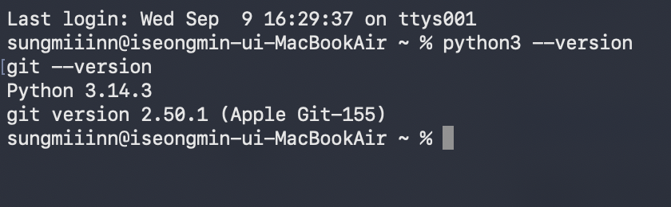
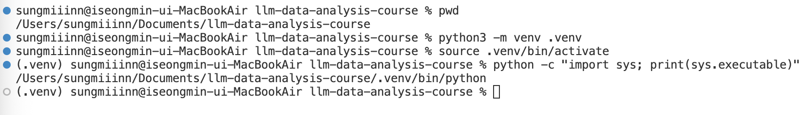
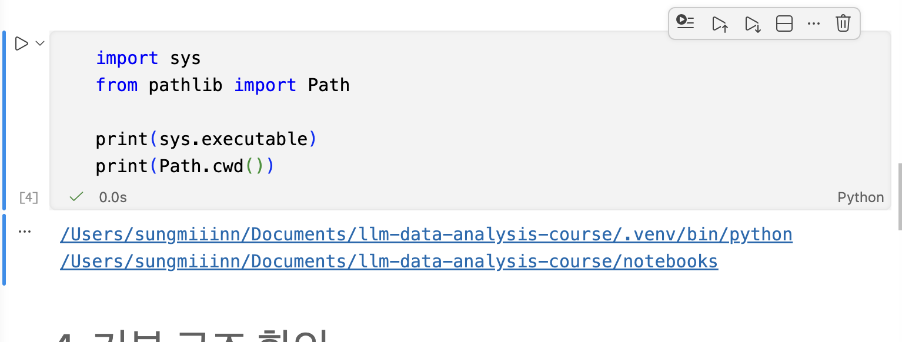
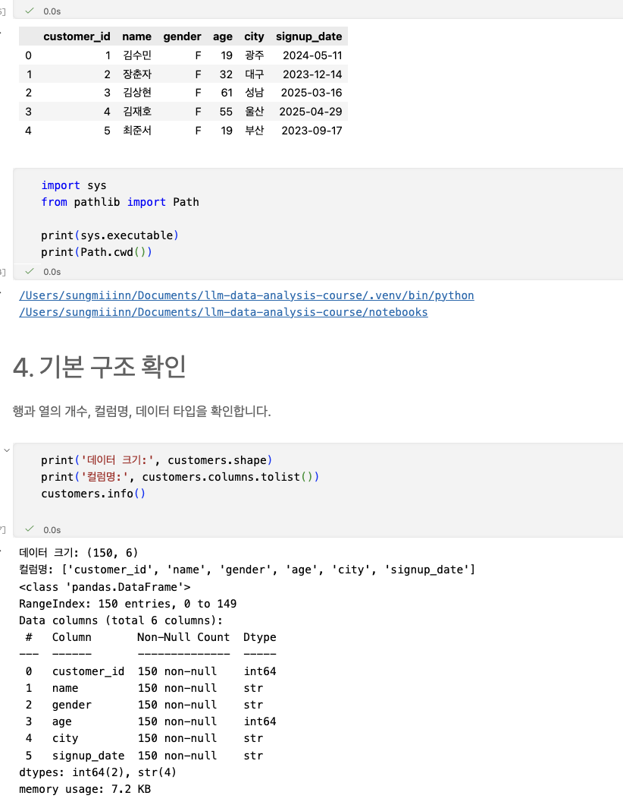
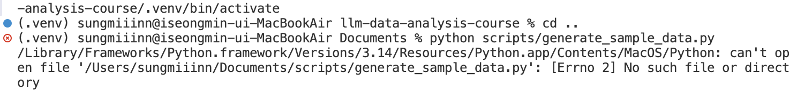
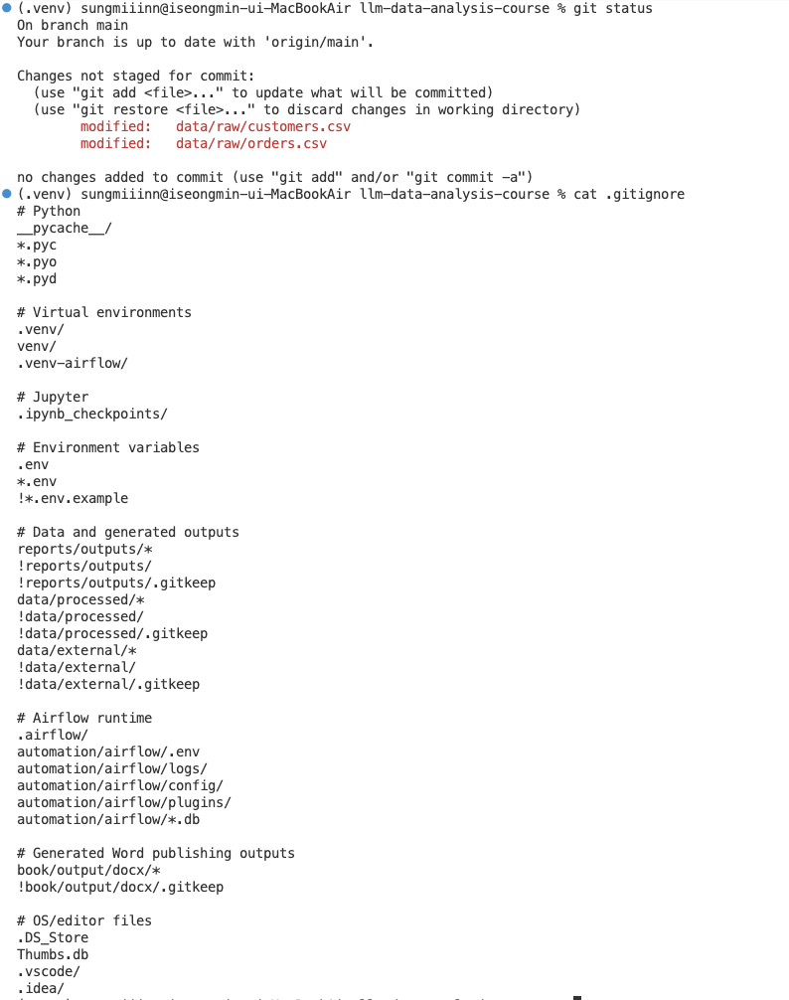

# Chapter 02 제출 답안. VS Code에서 시작하는 데이터 분석 환경

> 최종 파일은 개인 GitHub 저장소의 `chapter02/chapter02.md`로 저장하는 것을 권장합니다.

## 0. 제출 정보

- 이름: 이성민
- GitHub ID: minilee0307-dot
- 개인 저장소: `llm-data-analysis-study`
- 작성일: 2026-09-10
- 운영체제: macOS

### 최종 제출 URL

```text
https://github.com/<minilee0307-dot>/llm-data-analysis-study/blob/main/chapter02/chapter02.md
```

---

## 1. Python과 Git 환경 확인

### 실행 내용

```text
python3 --version
git --version
```

### 실행 결과

```text
Python 3.14.3
git version 2.50.1 (Apple Git-155)
```

### Evidence



### 결과 관찰

Python 3.14.3과 Git 2.50.1이 정상적으로 출력되었으며, 두 명령어 모두 오류 없이 실행되었다.

### 나의 해석과 판단

Python과 Git이 다 잘 설치되어있고 실습 진행 환경 조성 완료했다 판단.

### 업무·분석적 의미

프로젝트를 시작하기 전에 Python과 Git의 버전과 실행 가능 여부를 확인하면, 이후 발생하는 오류가 설치 문제인지 프로젝트 설정 문제인지 구분하는 데 도움이 된다.

### 한계와 추가 확인 사항

현재는 Python과 Git이 실행되는 것만 확인했기 때문에, 패키지들 다 잘 되는지나 다른 프로그램의 설치 상황 전부 모름.

---

## 2. 저장소와 `.venv` 준비

### 수행 내용

- [x] 공식 Public 저장소 clone
- [x] 프로젝트 루트 확인
- [x] `.venv` 생성
- [x] `.venv` 활성화
- [x] `requirements.txt` 설치

### 핵심 실행 결과

```text
현재 프로젝트 경로:
/Users/sungmiiinn/Documents/llm-data-analysis-course

터미널 Python 실행 파일:
/Users/sungmiiinn/Documents/llm-data-analysis-course/.venv/bin/python

가상환경 활성화 여부:
활성화됨 (`(.venv)` 표시 확인)

패키지 설치 결과:
`requirements.txt`에 포함된 패키지 설치 완료
```

### Evidence



### 결과 관찰

공식 저장소를 clone한 뒤 프로젝트 루트에서 `.venv` 가상환경을 생성하고 활성화했다. 이후 Python 실행 경로를 확인한 결과 현재 프로젝트 내부의 `.venv/bin/python`이 사용되고 있었으며, 필요한 패키지도 이 가상환경에 설치된 것을 확인했다.

### 나의 해석과 판단

프로젝트 별로 다른 가상환경을 쓰면 패키지가 충돌할 일도 없어지고, 만약 서로 다른 버전들을 프로젝트 각각 사용하고 싶을때 쉽게 사용 가능하다는 점에서 venv로 가상환경 분리가 유용한거 같다.

### 업무·분석적 의미

프로젝트별로 가상환경을 분리해두면 각 프로젝트에서 필요한 Python과 패키지 버전을 독립적으로 관리할 수 있다. 이를 통해 다른 프로젝트의 설정 변경 때문에 현재 분석 환경이 깨지는 일을 줄일 수 있고, 같은 환경을 다시 구성하기도 쉬워진다.

### 한계와 추가 확인 사항

현재는 터미널에서 `.venv`의 Python을 사용하고 있다는 것과 필요한 패키지가 설치된 것까지 확인했다. 다만 VS Code의 Python Interpreter와 Jupyter Notebook Kernel도 같은 `.venv`를 사용하고 있는지는 추가로 확인해야 한다.

---

## 3. VS Code 인터프리터와 Jupyter 커널 연결

### 확인 결과

```text
VS Code Python 인터프리터:
현재 프로젝트의 `.venv` Python 3.14.3

Notebook sys.executable:
/Users/sungmiiinn/Documents/llm-data-analysis-course/.venv/bin/python

Notebook Path.cwd():
/Users/sungmiiinn/Documents/llm-data-analysis-course/notebooks
```

### Evidence



### 결과 관찰

터미널과 VS Code, Jupyter Notebook에서 사용하는 Python 경로를 확인한 결과 모두 현재 프로젝트의 `.venv`를 사용하고 있었다. Notebook의 현재 작업 경로는 `notebooks` 폴더로 확인되었다.

### 나의 해석과 판단

터미널, VS Code, Jupyter Notebook이 모두 같은 `.venv`를 사용하고 있으므로 실행 환경이 일관되게 연결되어 있다고 판단했다. 이렇게 환경을 통일하면 한 곳에 설치한 패키지를 다른 곳에서도 동일하게 사용할 수 있어 실행 오류를 줄일 수 있다.

### 업무·분석적 의미

터미널, VS Code, Jupyter Notebook이 서로 다른 Python 환경을 사용하면 패키지를 설치했는데도 다른 곳에서 인식하지 못하는 문제가 생길 수 있다. 따라서 프로젝트 시작 단계에서 세 환경이 같은 `.venv`를 사용하는지 확인하는 것이 중요하다.

### 한계와 추가 확인 사항

현재 터미널, VS Code, Jupyter Notebook이 같은 `.venv`를 사용하고 있다는 것은 확인했다. 다만 실제 데이터 파일을 읽고 분석 코드가 정상적으로 실행되는지까지 확인해야 전체 환경이 제대로 구성되었다고 볼 수 있다.

---

## 4. 샘플 데이터와 Notebook 실행 검증

### 확인 결과

```text
DATA_DIR 존재 여부: 존재함

customers.csv 존재 여부: 존재함

customers.shape: (150, 6)

주요 컬럼:
customer_id, name, gender, age, city, signup_date
```

### Evidence



### 결과 관찰

customers.csv를 Notebook에서 불러온 결과 총 150행 6열의 데이터가 정상적으로 로딩되었다. 주요 컬럼은 customer_id, name, gender, age, city, signup_date였으며, 각 컬럼의 Non-Null Count가 모두 150으로 확인되어 현재 데이터에는 결측치가 없었다.

### 나의 해석과 판단

Notebook에서 `customers.csv`가 정상적으로 로딩되고 데이터의 크기, 컬럼명, 자료형까지 확인되었으므로 현재 Python 환경과 데이터 경로가 정상적으로 연결되어 있다고 판단했다. 또한 모든 컬럼의 Non-Null Count가 150으로 확인되어 이 데이터에서는 결측치 문제 없이 다음 분석을 진행할 수 있다고 보았다.

### 업무·분석적 의미

실제 데이터 분석을 시작하기 전에 데이터가 정상적으로 불러와지는지, 필요한 컬럼이 있는지, 결측치가 있는지를 먼저 확인하면 이후 분석 과정에서 발생할 수 있는 오류를 줄일 수 있다. 또한 데이터 구조를 미리 파악하면 어떤 분석이 가능한지도 판단하기 쉬워진다.

### 한계와 추가 확인 사항

현재는 `customers.csv`가 정상적으로 로딩되고 기본 구조까지 확인했다. 다만 다른 데이터 파일들도 같은 방식으로 정상적으로 읽히는지, 날짜형 컬럼이 적절한 자료형으로 처리되는지, 이후 분석에 필요한 컬럼들이 실제로 충분한지는 추가로 확인할 필요가 있다.

---

## 5. 오류 해결 기록

실습 중 오류가 있었다면 작성합니다. 오류가 없었다면 `해당 없음`이라고 적습니다.

### 오류 메시지

```text
python: can't open file '/Users/sungmiiinn/Documents/scripts/generate_sample_data.py'
```

### 원인 후보

현재 작업 경로가 `llm-data-analysis-course` 프로젝트 루트가 아니라
상위 폴더인 `Documents`였기 때문에 `scripts/generate_sample_data.py` 파일을 찾지 못했다.

### 해결 방법

```text
`cd llm-data-analysis-course` 명령으로 프로젝트 루트로 이동한 뒤
`python scripts/generate_sample_data.py`를 다시 실행했다.
```

### Evidence




## 6. Secret 보호 확인

- [x] `.env`는 Git 추적 대상이 아닙니다.
- [x] 실제 API Key를 코드에 작성하지 않았습니다.
- [x] 캡처 화면에 Token/비밀번호가 없습니다.
- [x] `.venv`를 Git에 올리지 않습니다.

### Evidence

필요한 경우 `git status`, `.gitignore` 확인 화면을 첨부합니다.



### 나의 해석과 판단

`.env`나 API Key와 같은 비밀정보가 GitHub에 올라가면 외부에 노출될 수 있기 때문에 코드와 분리해서 관리해야 한다고 생각했다. 또한 `.venv`는 프로젝트 환경을 구성하기 위한 폴더이므로 Git에 직접 올리기보다 `requirements.txt`를 통해 필요한 패키지를 다시 설치할 수 있도록 하는 것이 적절하다고 판단했다.

---

## 7. Chapter 02 최종 회고

### 가장 중요했다고 생각한 환경 설정 1가지

```text
터미널, VS Code Python Interpreter, Jupyter Notebook Kernel이 모두 같은 `.venv`를 사용하도록 설정하는 것이 가장 중요했다고 생각한다.
```

### 그 이유

```text
서로 다른 Python 환경을 사용하면 한 곳에서 패키지를 설치했더라도 다른 곳에서는 인식하지 못하는 문제가 생길 수 있기 때문이다. 같은 `.venv`를 사용하도록 맞추면 프로젝트의 Python과 패키지 환경을 일관되게 유지할 수 있다.
```

### 다음 Chapter에서 재사용할 환경 체크 3가지

1. 현재 Python 실행 경로가 프로젝트의 `.venv`인지 확인한다.
2. VS Code Interpreter와 Jupyter Kernel이 같은 `.venv`를 사용하는지 확인한다.
3. 데이터 파일의 경로가 올바르고 실제로 정상 로딩되는지 확인한다.

### 현재 환경의 한계 또는 주의점

```text
현재는 Chapter 02의 샘플 데이터가 정상적으로 로딩되는 것까지 확인했다. 다만 다른 프로젝트에서는 Python이나 패키지 버전이 다를 수 있으므로 프로젝트마다 가상환경과 requirements를 다시 확인해야 한다.
```

---

## 최종 제출 체크

- [x] 핵심 Evidence 4~7장을 첨부했습니다.
- [x] 단순 캡처가 아니라 관찰과 판단을 작성했습니다.
- [x] Secret/개인정보가 없습니다.
- [x] GitHub에서 이미지가 정상 표시됩니다.
- [x] 개인 저장소에 `chapter02/chapter02.md`를 업로드했습니다.
- [x] 저장소 URL이 아니라 최종 파일 URL을 제출합니다.
