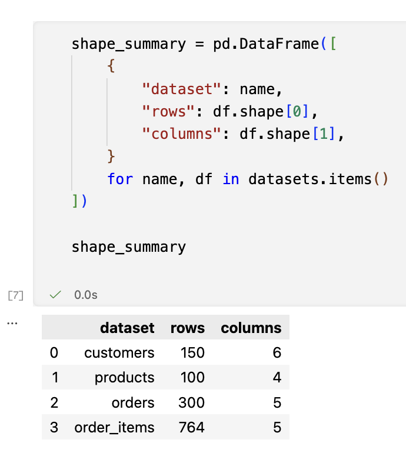
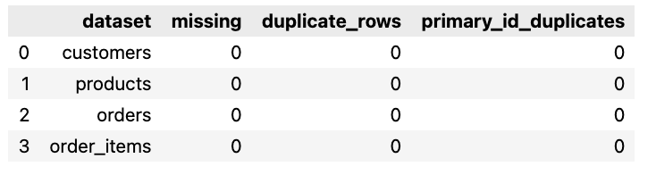
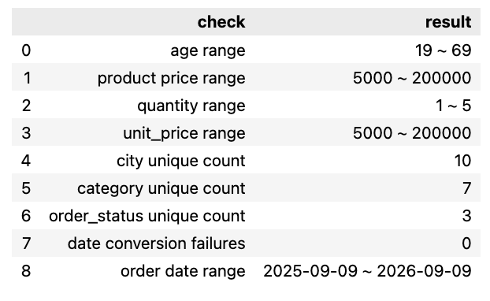
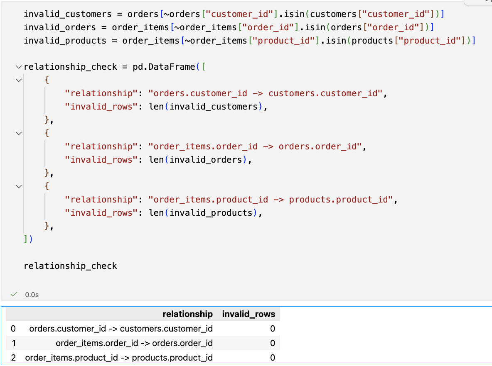
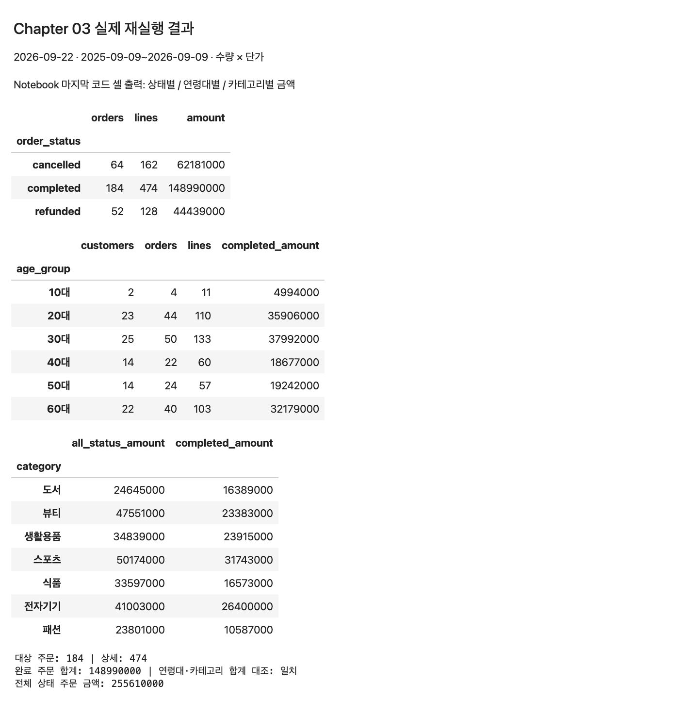

# Chapter 03 제출 답안. 데이터의 첫인상 읽기

## 0. 제출 정보

- 이름: 이성민
- GitHub ID: minilee0307-dot
- 수정·재실행일: 2026-09-22
- 최종 제출 URL: https://github.com/minilee0307-dot/llm-data-analysis-study/blob/main/chapter03/chapter03.ipynb
- 실습 수행 상태: **COMPLETE** — 아래 모든 코드 셀을 순서대로 재실행하고 출력을 저장했다.
- GitHub 반영·표시 확인: **COMPLETE** — GitHub에 커밋을 반영했고 Notebook·Markdown의 본문, 저장된 출력과 Evidence 5장의 표시를 확인했다.

공식 [실습 가이드](https://github.com/GilbertMoon/llm-data-analysis-course/blob/main/practice/chapter03/chapter03.md)와 [제출 양식](https://github.com/GilbertMoon/llm-data-analysis-course/blob/main/practice/chapter03/templates/chapter03_assignment.md)의 1~6번에 맞춰 정리했다.
기존 실습에서 생성한 가상 쇼핑몰 CSV를 `data/`에 그대로 보존했다. 새로 생성하면 날짜가 달라질 수 있어 재생성하지 않았다. 실제 고객 정보는 아니다.
기존 ChatGPT 도움에 이어 이번 수정은 Codex의 코드 점검·실행·문장 정리 도움을 받았다. 모델이 제안한 내용과 실행으로 확인한 결과를 구분해 기록했다.

재실행: 이 저장소를 내려받고 Python 가상환경에 `chapter03/requirements.txt`를 설치한 뒤 해당 환경을 Notebook 커널로 선택하여 전체 실행한다. 원본 CSV는 수정하지 않는다.

## 1. 데이터 로딩과 구조 확인

### 실행/결과
파일 존재 여부, 파일별 행·열, 실제 컬럼명과 읽기 직후 dtype을 먼저 확인했다. 아래 표와 `head()`, `tail()`, `info()`가 실행 근거다.

### Evidence

기존 실습 캡처이며, 이번 재실행의 `shape_summary`와 네 파일의 행·열 수가 모두 일치한다. 상세 컬럼과 dtype은 위 실행 표에 남겼다.

### 결과 관찰
customers는 150행 6열, products는 100행 4열, orders는 300행 5열, order_items는 764행 5열이다. 고객은 `customer_id, name, gender, age, city, signup_date`, 상품은 `product_id, product_name, category, price`, 주문은 `order_id, customer_id, order_date, payment_method, order_status`, 주문 상세는 `order_item_id, order_id, product_id, quantity, unit_price`로 구성되어 있다.
읽기 직후 ID와 `age, price, quantity, unit_price`는 `int64`, 나머지는 `str`이다. 날짜 두 컬럼도 처음에는 `str`였다.

### 나의 해석과 판단
주문 하나에 상품 여러 개가 들어갈 수 있으므로 주문 상세 764행을 주문 764건이라고 세면 안 된다. ID는 숫자형이어도 평균보다 고유성과 연결 여부가 중요하다고 판단했다.

### 업무·분석적 의미
매출 계산에는 주문 상세의 수량과 단가가 필요하고, 완료 주문만 선택하려면 주문 테이블의 상태를 연결해야 한다. 컬럼 이름만 보고 하나의 파일로 분석할 수 있다고 판단하면 계산 기준을 놓칠 수 있다.

### 한계와 추가 확인 사항
앞·뒤 몇 행은 전체 품질을 보장하지 않는다. 이 한계는 아래 전수 검사로 보완했다. 데이터는 가상 자료이므로 실제 고객 행동을 대표한다고 볼 수 없다.

## 2. 결측·중복·키 품질

### 실행/결과
전체 20개 원본 컬럼의 결측 개수·비율, 전체 행 중복, 네 고유키의 결측·중복을 별도로 검사했다.

### Evidence

기존 캡처의 0건 결과를 재실행으로 확인했다. 이번에는 `order_item_id`를 포함한 네 고유키의 결측·중복과 고유 개수를 위 표에 명시했다.

### 결과 관찰
20개 컬럼 모두 결측 0건(0%)이고 네 파일의 전체 행 중복도 각각 0건이다. `customers.customer_id`, `products.product_id`, `orders.order_id`, `order_items.order_item_id`는 각각 결측 0건·중복 0건이며 고유값 수는 150, 100, 300, 764개다.
반면 `order_items.order_id`의 첫 출현 이후 반복은 464행이다. `(order_id, product_id)` 조합도 첫 출현 이후 10행이 반복된다.

### 나의 해석과 판단
고유키 검사 범위에서는 우선 수정해야 할 문제가 없었다. 주문 ID 반복은 주문과 상세의 일대다 관계이므로 삭제하지 않았다. 같은 주문에서 같은 상품이 반복된 10행도 `order_item_id`는 서로 다르다. 원본 생성 코드는 상품을 반복 추출하므로 이 조합의 반복을 곧바로 입력 오류로 볼 수 없다.

### 업무·분석적 의미
고유키 중복은 병합 시 행과 금액을 늘릴 수 있지만, 정상 상세 행을 중복이라고 삭제하면 금액이 줄어든다. 중복을 처리하기 전에 한 행이 무엇을 의미하는지 확인해야 한다.

### 한계와 추가 확인 사항
결측·중복이 0이라는 사실은 날짜의 앞뒤 관계나 업무적 타당성까지 보장하지 않는다. 실제 거래에서는 같은 상품을 별도 상세 행으로 기록하는 규칙도 확인해야 한다.

## 3. 숫자형·범주형·날짜 점검

### 실행/결과
숫자형은 ID를 제외하고 통계를 구했다. 범주형은 일부만 자르지 않고 모든 값의 빈도를 확인했다. 날짜 변환 전 결측과 변환으로 새로 생긴 실패를 구분했다.

### Evidence

기존 캡처의 숫자 범위와 주문 기간이 이번 결과와 일치한다. 성별·결제수단을 포함한 전체 빈도와 가입일 변환 결과는 위 출력으로 보완했다.

### 결과 관찰
- age는 19~69세(평균 42.0867, 중앙값 40), price는 5,000~200,000(평균 110,040, 중앙값 112,000), quantity는 1~5(평균 3.0537, 중앙값 3), unit_price는 5,000~200,000(평균 108,561.5183, 중앙값 111,000)이다.
- 성별은 F 84명, M 66명이다. 지역은 성남 21, 광주 17, 부산 16, 대구·서울 각각 15, 울산·인천·대전 각각 14, 수원 13, 고양 11명이다.
- 상품 카테고리는 스포츠 19, 전자기기 17, 생활용품·뷰티 각각 16, 도서 14, 패션 11, 식품 7개다.
- 결제수단은 kakao_pay 79, naver_pay 77, bank_transfer 74, card 70건이다.
- 주문 상태는 **completed 184건, cancelled 64건, refunded 52건**으로 총 300건이다.
- 두 날짜는 `str`에서 `datetime64[us]`로 변환되었다. 변환 전 결측과 변환 실패는 모두 0건이다. 주문일은 **2025-09-09~2026-09-09**, 가입일은 **2023-09-16~2026-09-05**다.

### 나의 해석과 판단
숫자 범위에서는 음수 가격이나 0 이하 수량이 보이지 않았다. 그렇다고 통계적 이상치나 업무 오류가 전혀 없다고 단정하지는 않았다. cancelled와 refunded가 116건이므로 모든 주문 금액을 완료 주문 매출이라고 부르면 안 된다고 판단했다.

### 업무·분석적 의미
주문 상태를 거르지 않으면 분석 대상이 달라진다. 월별 비교에서도 시작 월과 끝 월은 한 달 전체가 아니므로 단순 합계를 같은 조건으로 비교하기 어렵다.

### 한계와 추가 확인 사항
통화 컬럼은 없어서 금액은 CSV의 단가 단위로 표시했다. 할인·세금·배송비·부분 환불 기록은 없어 실제 정산액을 계산할 수 없다. 날짜 변환 성공 여부와 날짜 사이의 논리적 순서는 별개의 문제라 다음 절에서 추가 검사했다.

## 4. CSV 간 키 관계 검증

### 실행/결과
세 FK가 부모 테이블에 존재하는지 확인한 뒤 `many_to_one` 조건으로 병합했다. 행 수 보존과 날짜 순서도 점검했다.

### Evidence

기존 캡처와 이번 FK 검사 결과가 일치한다. 추가한 병합·날짜 순서 검사는 위 `join_checks` 출력에 남겼다.

### 결과 관찰
없는 `customer_id` 0행, 없는 `order_id` 0행, 없는 `product_id` 0행이다. 병합 전후 상세 행은 모두 764행이고 연결 후 category·age·order_status의 결측도 0건이다. 상세가 없는 주문은 0건이다.
그러나 **가입일보다 이른 주문이 48건(300건 중 16%)** 있었다. 이는 상세 행 기준이 아닌 주문 기준으로 센 값이다.

### 나의 해석과 판단
키가 모두 연결된다는 것과 업무적으로 날짜가 자연스럽다는 것은 달랐다. 생성 코드를 보면 가입일과 주문일을 독립적으로 뽑고 있어 날짜 역전이 생길 수 있다. 다만 비회원 주문 등 실제 업무 규칙은 이 자료만으로 알 수 없으므로 48건을 임의 삭제하거나 날짜를 고치지 않았다.

### 업무·분석적 의미
FK 누락과 병합 중 행 증가를 확인하면 금액 집계가 빠지거나 부풀려지는 것을 막을 수 있다. 가입 시점을 기준으로 재구매·가입 후 경과일을 분석할 때에는 별도로 발견한 날짜 역전이 문제가 된다.

### 한계와 추가 확인 사항
현재 결과는 이 CSV 스냅샷에 대한 검사다. 실제 데이터에서 FK 누락이 생기면 누락 파일, 자료형, 수집 시점 등을 먼저 확인해야 하며 바로 행을 버리면 안 된다. 가입 이후 행동 분석은 날짜 생성·기록 기준을 확정한 뒤 진행해야 한다.

## 5. LLM 구조 설명 검증

### LLM에 제공한 Safe Context
기존 Notebook에는 구조 요약 프롬프트와 연령대별 매출 제안에 대한 검토가 저장되어 있었다. 다만 독립된 LLM 원문 응답은 확인할 수 없어 아래에서 기존 기록과 이번 Codex 보완 제안을 구분했다. 아래 프롬프트는 이번 실제 출력으로 갱신한 기록이며, 별도 API 호출을 실행했다고 주장하지 않는다. 고객 이름이나 개별 거래 행은 포함하지 않았다.

### 제안·실제 검증·판단 (Prompt Log)

| 출처 / 제안 | 실제 검증 결과 | 판단과 반영 |
| --- | --- | --- |
| 기존 Notebook 기록: age로 연령대별 매출을 바로 분석 | age 존재, 결측 0, 범위 19~69. 세 FK 누락 0. 그러나 상태는 completed 184 / cancelled 64 / refunded 52건 | **수정**. 기간·매출 산식·상태·연령 구간을 아래처럼 정하고 실행했다. |
| 이번 Codex 보완: 고유키와 FK를 따로 검사 | 네 PK 결측·중복 각 0, 상세 order_id 반복 464행 | **사용**. PK 검사를 완성하고 정상 FK 반복은 유지했다. |
| 이번 Codex 보완: 날짜 변환뿐 아니라 가입일과 주문일 순서도 검사 | 변환 실패는 0이지만 가입 전 주문은 48건 | **사용**. 날짜 역전을 품질 한계에 기록하고 원본을 보존했다. |
| 날짜만으로 가입 후 구매 행동을 해석할 수 있다는 가정 | 가입 전 주문 48건, 실제 가입·주문 기록 규칙 없음 | **보류**. 이는 추가 검토 가정이며 기존 LLM의 실제 발언으로 기록하지 않았다. 가입 시점 기반 해석은 하지 않았다. |

### 수정한 최종 분석 질문
**2025-09-09부터 2026-09-09까지(양 끝 날짜 포함), `order_status == 'completed'`인 주문만 대상으로 `quantity × unit_price`를 합산한 주문 금액은 고객의 기록된 연령대별로 어떻게 다른가?**
연령대는 10대 10~19세, 20대 20~29세, …, 60대 60~69세로 정의한다. 나이는 고객 테이블에 기록된 값이며 주문 당시 나이라고 단정하지 않는다. 여기서 매출은 위 산식으로 정의한 완료 주문 금액이며, 실제 순매출·이익을 뜻하지 않는다.

### Evidence

이번 재실행의 상태별·연령대별·카테고리별 출력 화면이다. 기존 `step05_llm.png`는 기준을 아직 정하기 전 기록이라 최종 Evidence에서는 교체했다.

### 결과 관찰
완료 주문은 184건, 상세 474행이며 합계는 **148,990,000**이다. 취소 주문 금액은 62,181,000, 환불 주문 금액은 44,439,000이고, 모든 상태를 합친 주문 금액은 **255,610,000**이다. 연령대별 및 카테고리별 완료 금액의 합계는 병합 전 원본으로 재계산한 148,990,000과 일치했다.

### 나의 해석과 판단
가장 유용한 점은 LLM의 아이디어를 실제 컬럼·키·조건으로 나누어 확인한 것이다. 반면 `age`가 있다는 사실만으로 바로 매출 분석이 준비되었다고 판단하는 것은 조심해야 한다. 기존 카테고리 집계는 모든 상태를 포함한 주문 금액이므로 완료 매출과 분리했다.

### 한계와 추가 확인 사항
연령대 합계 차이는 고객 수·주문 수의 차이도 반영한다. 이 결과만으로 특정 연령대의 개인 구매력이 높다거나 나이가 매출의 원인이라고 말할 수 없다. 가상 자료의 집계 연습이며, 실제 정산이나 시장 해석에 사용하지 않는다.

## 6. Chapter 03 최종 판단

### 데이터의 첫인상 3가지
1. 네 CSV는 총 1,314행으로 고객·상품·주문·상세 역할이 나뉜다. 병합 후에도 상세 764행이 보존되었다.
2. 결측·전체 중복·고유키 중복·FK 누락은 모두 0이지만, 가입 전 주문 48건은 따로 발견되었다. 기본 검사에서 문제가 없어도 모든 데이터가 타당한 것은 아니었다.
3. 매출 조건에 따라 전체 주문 금액 255,610,000과 완료 주문 금액 148,990,000으로 결과가 달라졌다. 실제 분석 질문에 조건을 적는 것이 중요했다.

### 다음 Chapter 전에 반드시 확인/처리해야 할 항목
1. **처리 완료:** 이번 집계의 기간, completed 조건, 수량×단가 산식과 연령 구간을 확정했다. 다음 장에서도 이 기준을 재사용한다.
2. **발견·보류:** 가입 전 주문 48건을 보존하고, 가입 시점을 사용하는 분석 전에는 생성·기록 규칙을 확인한다. 임의로 날짜를 고치지 않는다.
3. **추가 자료 필요:** 실제 매출로 확장하려면 통화·할인·세금·부분 환불과 나이의 기준 시점을 확인한다. 현재 자료에 없는 값을 채워 넣지 않는다.

### 현재 데이터만으로 단정할 수 없는 것
실제 고객 전체의 구매 성향, 연령과 매출의 인과관계, 실제 순매출·이익, 날짜 역전의 실제 업무 원인은 단정할 수 없다. 이번 장에서는 구조와 품질을 직접 검증하고 분석 가능한 범위까지 확인했다.

## 최종 제출 체크

- [x] Notebook을 처음부터 끝까지 실행했습니다.
- [x] 오류 셀이 남아 있지 않습니다.
- [x] 핵심 Evidence 5장을 본문에 연결했습니다.
- [x] 관찰과 해석을 구분했습니다.
- [x] 원본은 수업용 가상 데이터이며 개인정보/Secret을 추가하지 않았습니다.
- [x] 수정한 `chapter03/chapter03.ipynb`가 GitHub에서 정상 표시됩니다.
- [x] 최종 Notebook 파일 URL을 명시했습니다.
- [ ] eTL 제출/재제출 여부는 별도로 확인해야 합니다.